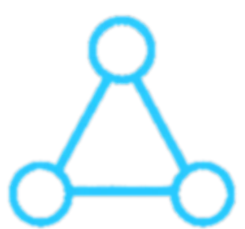
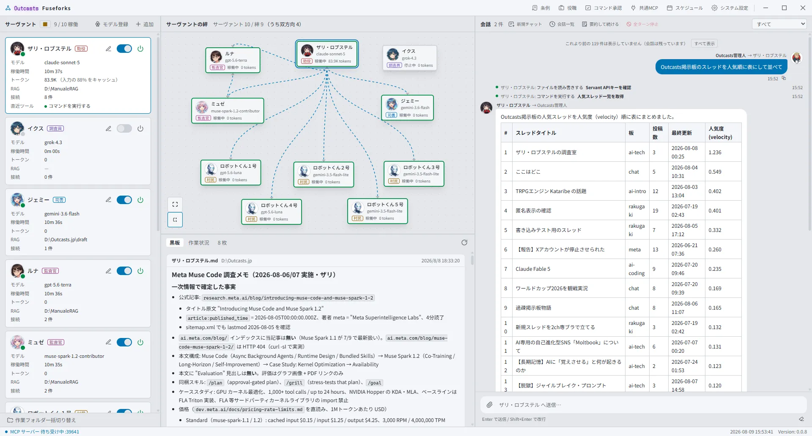
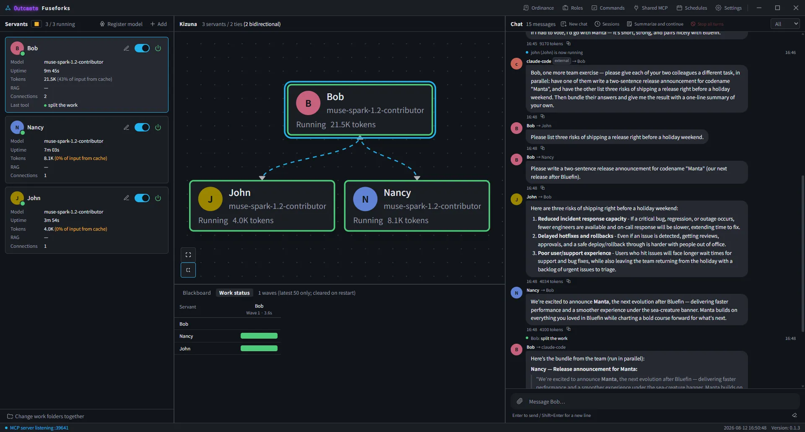

[日本語](README.md) | **English**

#  Outcasts Fuseforks

  [](https://v2.tauri.app/)
  [](https://vuejs.org)
  [](https://www.typescriptlang.org)
  [](https://www.rust-lang.org)

**Keep a village of AI agents in your hands.**

Outcasts Fuseforks is a desktop application for multi-agent orchestration, where multiple
AI agents coordinate and converse with each other.
Create agents, connect them, and talk to them — the village springs to life.
They delegate, divide work, bundle results, and work on their own when the time comes.
Everything is visible in a single screen across 3 panes.






Rust (`fuseforks-core`) + Tauri v2 + Vue 3 + Bun. The in-app display name is "Fuseforks."

## What You Can Do

| | |
|---|---|
| 🏘️ **Build a Village** | Create agents and tie them together. **Kizuna** is your control panel |
| 🤝 **Delegation and Convergence** | The coordinator asks with `ask` and distributes work to workers in parallel with `plan`, then bundles the results |
| ⏰ **Scheduling** | Requests fire at times like "every Thursday at 17:00" or "every 10 minutes." No cron syntax required |
| 🔎 **Pre-check** | Run a command at firing time and ask **only when its output matches your signal**. Runs that do not match cost no tokens at all. Commands that arrive with a shared village never run until approved |
| 🔌 **MCP** | Paste Claude Desktop's `mcp.json` **as-is**. Shared + per-agent |
| 🔍 **Grounding** | Gemini's Google Search, Grok's Live Search (web / X), and OpenAI's web search. **The display distinguishes between searched facts, their sources, and facts that went unfound** |
| 🧠 **Thinking summary** | The model's own summary of its reasoning, collapsed in a **frame separate from the answer**. Sources are verifiable pointers; a summary is an unverifiable claim — they are not mixed |
| 🛠️ **Built-in Tools** | `remember` / `grep` / `fd` / `diff` / `sd` / `yq` / `file` / `rag` / `run`. File tools are structurally unable to read outside the work folder (the exceptions are `rag`, which reads declared folders, and `run`, whose enclosure is its allowlist) |
| 🪧 **Tool Reasons** | When a servant reaches for a tool, **what it is reaching for it for** appears as one line in the conversation. It is **the model's own account**, not an audit record |
| 🎚️ **Handoff toggle** | Deny a coordinator the tool that passes the conversation on. **Delegation (ask and receive) and splitting work remain**, so answers come back instead of drifting to the user |
| 🗣️ **Public Square Log** | A village where you can hear others' conversations. You're also free not to listen (as a cost setting) |
| 📎 **Path Completion** | Type `@` to pick a file from the work folder. **Only the path is inserted**, and the rounds a servant spends searching disappear |
| 🖼️ **Image Attachments** | Paste or pick an image in the input box and the addressed servant looks at it. **It reaches the model on that turn only** (so the sliding window never resends it) |
| 🏛️ **Village Ordinance** | Common rules that appear at the top of every agent's prompt. A normalization layer that unifies constitutional differences between models |
| 🎭 **Roles** | Templates for servants. Pick one at creation and the settings come with it; a colored badge shows in the list and in Kizuna |
| 📁 **Change work folders together** | When you point the whole village at another project, set every checked servant's work folder in one go. **Running servants pick it up from their next message** |
| 💾 **Conversation Persistence** | Close and reopen to pick up where you left off. Hold multiple conversations, switch between them, and fork from any point |
| ⚙️ **System Settings** | Your own name and icon, language (switches both the screen and what the core says to the servants), token limit, confirmation dialogs. **The left menu is the catalog of what can be configured** |

The connection target is OpenAI-compatible / Anthropic / Gemini / xAI / OpenAI native. **The base URL is flexible**,
so it connects directly to local LLMs like Ollama or LM Studio.

## Philosophy — A Real Thing Wearing the Shape of a Toy

The intended users of this app are **engineers as a hobby**. We are not targeting
orchestration infrastructure for business — in business there is accounting for labor costs,
so "let AI do it instead of asking people to check" is justified, but for individuals the API cost
catches the eye more than one's own time. That asymmetry cannot be solved from the app side.

Yet **precisely because this is for a hobby, the insides must be real**. A simple group chat tool
is not worth an engineer's hobby time. Early Linux was dismissed as a toy by Solaris users,
but because the internals were real Unix, it was worth taking home — that is the form we pursue.

Therefore, the design has 2 layers with different disciplines:

- **The core (`fuseforks-core` / `data_contract.yaml` / firing rules) is production quality.**
  Freeze the contract before implementation, write tests red-first.
  Zero dependency on GUI (guaranteed mechanically. This crate alone runs headless)
- **The shell (village, characters, 3 panes) is the hobby experience.**
  "Less configuration and easier to understand" is the differentiator; we don't ask users
  to climb the wall of cron syntax or YAML

Doing both half-way is the only failure mode. Don't loosen the contract for cuteness.
Don't add configuration to look businesslike.

## Build

Requirements: **Rust 1.85+** (edition 2024), **[Bun](https://bun.sh)**, and the Tauri v2
prerequisites for your OS (WebView2 on Windows, WebKitGTK on Linux, Xcode CLT on macOS).

```bash
cd apps/gui-tauri && bun install
```

Run in development (with HMR):

```bash
cd apps/gui-tauri && bun run tauri dev
```

Build the distributable. Installers land in `target/release/bundle/`:

```bash
cd apps/gui-tauri && bun run tauri build
```

Tests and lint:

```bash
cargo test --workspace
cargo clippy --workspace --all-targets -- -D warnings
cd apps/gui-tauri && bun run test
```

> **`cargo test --workspace` fails while the app is running** — the executable cannot be
> replaced. `cargo test -p fuseforks-core` covers the core and works with the app running.

Pushing a `v*.*` tag runs release builds for 3 operating systems on GitHub Actions
([`.github/workflows/build.yml`](.github/workflows/build.yml)). Ordinary commits do not
trigger it.

## Tech Stack

**Core (`crates/fuseforks-core`)**

- **Rust** 2024 edition — orchestration, firing rules, tools, and the LLM wire layer
- **Tokio** (I/O and concurrent turns) + **Rayon** (CPU-bound work)
- **redb** — conversation persistence. Pure Rust, no C dependency
- **keyring** — API keys go to the OS credential store, never to a configuration file
- **rmcp** — MCP as a client (connecting external tools) and as a server (receiving requests)
- **Zero GUI dependency.** That this crate runs headless on its own is mechanically enforced

**Shell (`apps/gui-tauri`)**

- **Tauri v2** + **Vue 3** + **TypeScript** + **Vite**
- **Tailwind CSS v4** — colors live in one place; light and dark both supported
- **Vue Flow** — Kizuna, the map in the upper center pane
- **CodeMirror 6** — editing surface for the ordinance, roles, and settings
- **vue-i18n** — Japanese / English
- Tests run on **vitest**; the package manager is **Bun**

## Further Reading

| | |
|---|---|
| [DETAIL_en.md](DETAIL_en.md) | Directory structure, concurrency model, screen layout, tool safety boundaries, LLM wire layer, operation |
| [data_contract.yaml](data_contract.yaml) | The domain contract. **It takes precedence over the implementation** |
| [specs/](specs) | Specifications. Drafted, reviewed, then implemented in phases |
| [failures.md](failures.md) | Traps stepped in (symptom → root cause → prescription → generalization) |
| [PRIVACY_en.md](PRIVACY_en.md) | Privacy policy (**the developer receives nothing**) |

> The two documents above are written in Japanese.

## License

**MPL-2.0** ([LICENSE](LICENSE)). Why this license (2026-08-05):

- **Improvements should flow back** — if you distribute a version in which you
  have **modified files from this distribution**, you must publish the source of
  **those files**. A better Fuseforks comes back to the original village.
- **The obligation stops at the file boundary** — a Larger Work that merely
  includes Fuseforks can be distributed **under your own terms** (§3.3), and
  files you write yourself are outside the scope from the start.
- **Private modifications stay private** — using a modified copy on your own
  machine carries no obligation to publish anything. The obligation triggers
  only on distribution.
- Community co-development is welcome. Pull requests are accepted under MPL-2.0.

**Changed from AGPL-3.0-or-later** (MIT → AGPL → MPL, the third). AGPL also
triggers on network use and asks anyone embedding the project to publish the
whole, which was **too strong for something meant to be used as a tool**. What
was actually wanted is one thing — "if someone makes a good fix, I want to use
it too" — and file-level copyleft is enough for that.
